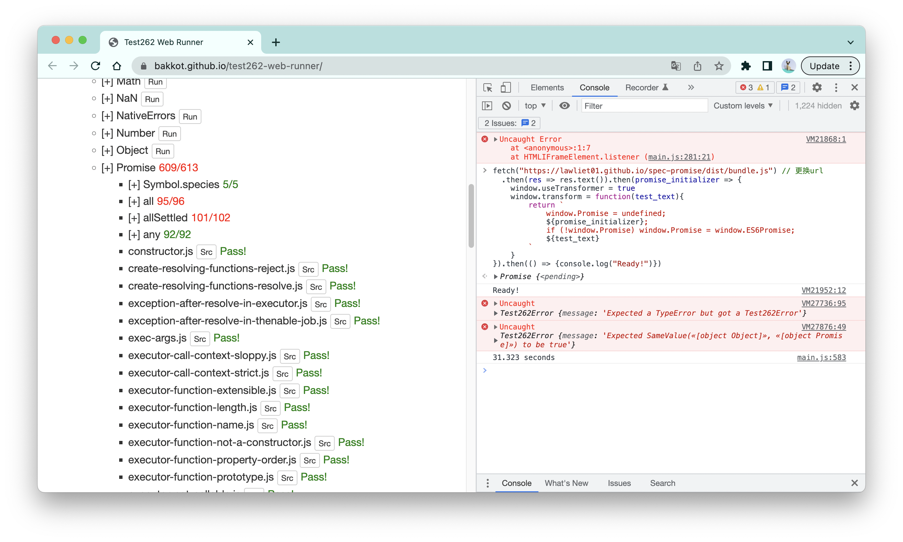

# spec-promise

spec-promise是一个完全基于[ECMAScript标准27.2](https://tc39.es/ecma262/multipage/control-abstraction-objects.html#sec-promise-objects)实现的Promise，可通过99.3%（609/613）的[test262](https://github.com/tc39/test262)标准符合性测试。

|                                                            | 测试通过率       |
| ---------------------------------------------------------- | ---------------- |
| spec-promise                                               | 99.3%（609/613） |
| [then/Promise](https://github.com/then/promise)            | 63.8%（391/613） |
| [es6-promise](https://github.com/stefanpenner/es6-promise) | 46.0%（282/613） |

spec-promise是[《人人都能读标准 —— ECMAScript篇》](https://github.com/Lawliet01/everyone-can-read-spec)的附属产品，旨在为读者展示基于标准的算法你可以做些什么。你也可以借助它在开发者工具上可视化promise的“正规”底层实现。

相关阅读：[18.基于标准手写一个Promise](https://github.com/Lawliet01/everyone-can-read-spec/blob/main/18.promise.md)

<br />


## 使用test262进行测试

使用test262对浏览器进行测试的方式非常简单：

1. 在[test262官方仓库](https://github.com/tc39/test262)中下载test262测试包（无需解压）；
2. 在浏览器上打开官方提供的[Test262 Web Runner](https://bakkot.github.io/test262-web-runner/)；
3. 点击`Local`，选择第一步下载完毕的测试包；
4. 选择需要测试的模块，点击`Run`。（Promise测试模块在built-ins -> Promises中）

Test262-Web-Runner通过创建新的iframe来获得“干净”的Realm，然后在这些Realm上面跑test262的测试用例。但Test262-Web-Runner开了一个“后门”，使得我们可以修改Realm中的对象。所以，在测试Promise前，我们需要先在开发者工具中运行以下的代码，以更换Realm中的Promise：

```js
fetch(URL) // 更换url
  .then(res => res.text()).then(promise_initializer => {
    window.useTransformer = true
    window.transform = function(test_text){
        return `
            window.Promise = undefined;
            ${promise_initializer};
            if (!window.Promise) window.Promise = window.ES6Promise;
            ${test_text}
        `
    }
}).then(() => {console.log("Ready!")})
```

在上述代码中更换以下不同的URL，就可以测试不同的Promise实现：

- spec-promise：https://lawliet01.github.io/spec-promise/dist/bundle.js
- [then/Promise](https://github.com/then/promise)：https://cdnjs.cloudflare.com/ajax/libs/promise-polyfill/8.3.0/polyfill.min.js
- [es6-promise](https://github.com/stefanpenner/es6-promise)：https://cdn.jsdelivr.net/npm/es6-promise@4/dist/es6-promise.js



在这里，4个没有通过的test cases，是因为它们都触及一些更为底层的行为，我无法修改这些行为，或者说为了通过这些测试，我需要违背成本收益原则地改造源码。

需要注意的是，**测试通过率并不意味着spec-promise比其他的promise更好，then/Promise是promise的超集，它提供了一些原生promise也没有的特性，如`promise.done`；而es6-promise，顾命思议，只实现到了es6。此外，spec-promise完全没考虑任何兼容性以及性能问题。**

